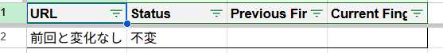

# html-ftp-checker

[](https://www.typescriptlang.org/) 
[](https://script.google.com/) 
[](https://nodejs.org/)

これは、指定されたウェブサイトの内部リンクを自動的にクロールし、「指紋」（SHA-256ハッシュ値）を生成してページの変更（追加、変更、削除、リンク切れ）を監視し、結果をレポートシートに出力するための Google Apps Script (GAS) プロジェクトです。

各実行結果は個別の `Run_*` シートに保存され、比較レポートは `Report_*` シートに生成されます。古いシートは自動的にクリーンアップされます。

このプロジェクトは TypeScript で記述されており、ローカルでの開発とデプロイのために `clasp` を使用します。HTML解析には `Cheerio` ライブラリを利用しています。

## 0. 使用イメージ(Usage image)
### 1.`Seed`
スクリプトの起点、必要な情報を記載の上でcheckボタンを押下するとスクリプトが起動します。
1. クロールしたいURLのhostname
2. クロールしたいURLのスタートページ(index.htmlなどのFVページ)


### 2. `Run_${実行回数}`(指紋内訳シート）
ページ内にのあらゆる`href`を保存して、もしの`hostname`と一致すれば対象としてfetchして、そのレスポンスの`blob`のhash-256値を指紋として算出して、保存します。


### 3. `Report_${実行回数}`（結果レポートシート）
Run_${今回の実行回数 - 1}の指紋と比較して、変化のあるページを記載します。<br>
<br>
もし全体と変化がなければ`不変`が表示されます。<br>


## 1. 前提条件 (Prerequisites)

作業を開始する前に、開発環境に以下のツールがインストールされていることを確認してください：

1.  **Node.js と npm**: [https://nodejs.org/](https://nodejs.org/)
2.  **Google clasp**: `clasp` は Google 公式のGASコマンドラインツールです。
    ```bash
    npm install -g @google/clasp
    ```
3.  **clasp 認証**: 以下のコマンドを実行し、ブラウザで Google アカウントにログインして `clasp` を承認してください。
    ```bash
    clasp login
    ```

## 2. インストール (Installation)

1.  **プロジェクトのクローン (Clone)**:
    ```bash
    git clone 'https://github.com/johnChow-tech/html-ftp-checker.git'
    cd html-ftp-checker
    ```
2.  **依存関係のインストール**: `npm install` を実行して、開発に必要なツール（TypeScript, @types/google-apps-script, npm-run-all など）をインストールします。
    ```bash
    npm install
    ```

## 3. Google スプレッドシートの設定 (Spreadsheet Setup)

このスクリプトを実行するには、紐付けられた Google スプレッドシートに以下の設定が必要です：

1. **`Seed` シート (`CONTROL_SHEET`)**:
    * この名前のシートを作成します。
    * 名前付き範囲 
      * **`base_domain`**: 監視対象のベースドメイン（例: `books.toscrape.com`）を入力するセルを作成し、そのセルに `base_domain` という名前を付けます。スクリプトはこの名前付き範囲からベースドメインを読み取ります。
      * **`seed_url`**: 抽出対象の種Url（index.htmlがオススメ。例: `https://books.toscrape.com/`）を入力するセルを作成し、そのセルに `seed_url` という名前を付けます。スクリプトはこの名前付き範囲からベースドメインを読み取ります。
        * **名前付き範囲の設定方法：**`データ > 名前付き範囲` から設定

## 4. 開発ワークフロー (Development Workflow)

ソースコードは `src` ディレクトリで編集し、`dist` ディレクトリからデプロイします。

1.  **コードの記述**:
    * すべてのソースコードは `src` フォルダ内の `.ts` ファイルに記述します (`main.ts`, `crawler.ts`, `sheetHandler.ts`, `reportGenerator.ts`, `types.ts`, `configs.ts` など)。
    * `clasp` は `dist` フォルダからプッシュするように設定されています (`.clasp.json`)。**`dist` 内の `.js` ファイルを直接編集しないでください**。

2.  **コンパイルとプッシュ (Deploy)**:
    * コード変更後、ターミナルで以下のコマンドを実行します：
        ```bash
        npm run push
        ```
    * このコマンドは自動的に `npx tsc` (TypeScriptコンパイル、`tsconfig.json` に基づき `src` から `dist` へ出力) と `clasp push` ( `dist` の内容をGASプロジェクトへプッシュ) を実行します。

## 5. 実行方法 (How to Run)

1. Google Apps Script エディタを開きます。
2. 実行したい関数（通常は `checkInternalLinks`）を関数セレクターから選択します。
3. 「実行」ボタンをクリックします。
4. 初回実行時には、スクリプトに必要な権限（外部サービスへのアクセス、スプレッドシートの編集など）を承認するよう求められます。

スクリプトは `種URLマスタ` からURLを読み込み、クロールを実行し、結果を新しい `Run_*` シートに書き込み、前回の実行結果と比較して `Report_*` シートを生成します。

## 6. プロジェクト構造 (Project Structure)
```bash
[プロジェクトルート]/
├── .clasp.json       # clasp 設定ファイル (rootDir: "dist")
├── .claspignore      # clasp プッシュ除外設定
├── .gitignore        # Git 除外設定 (node_modules など)
├── package.json      # npm 依存関係とスクリプト
├── tsconfig.json     # TypeScript 設定 (outDir: "./dist")
├── README.md         # このファイル
│
├── src/              # ⭐️ ソースコード (.ts ファイルを編集する場所)
│   ├── main.ts             # メインロジック、実行フロー制御
│   ├── crawler.ts          # URL取得、HTML解析、リンク抽出、指紋生成
│   ├── sheetHandler.ts     # スプレッドシートの読み書き、シート操作全般
│   ├── reportGenerator.ts  # 実行結果の比較、レポートデータ生成
│   ├── types.ts            # プロジェクト共有の TypeScript 型定義
│   ├── configs.ts          # グローバル定数
│   └── cheerio.d.ts        # Cheerio ライブラリの型定義ファイル
│
├── dist/             # ⭐️ コンパイル後の出力先 (clasp がプッシュする内容)
│   ├── appsscript.json     # GAS マニフェストファイル (ライブラリ依存含む)
│   ├── main.js
│   ├── crawler.js
│   ├── sheetHandler.js
│   ├── reportGenerator.js
│   ├── types.js            # (型情報は削除される)
│   └── configs.js
│
└── node_modules/     # npm install で生成 (Git/clasp では無視)
```
