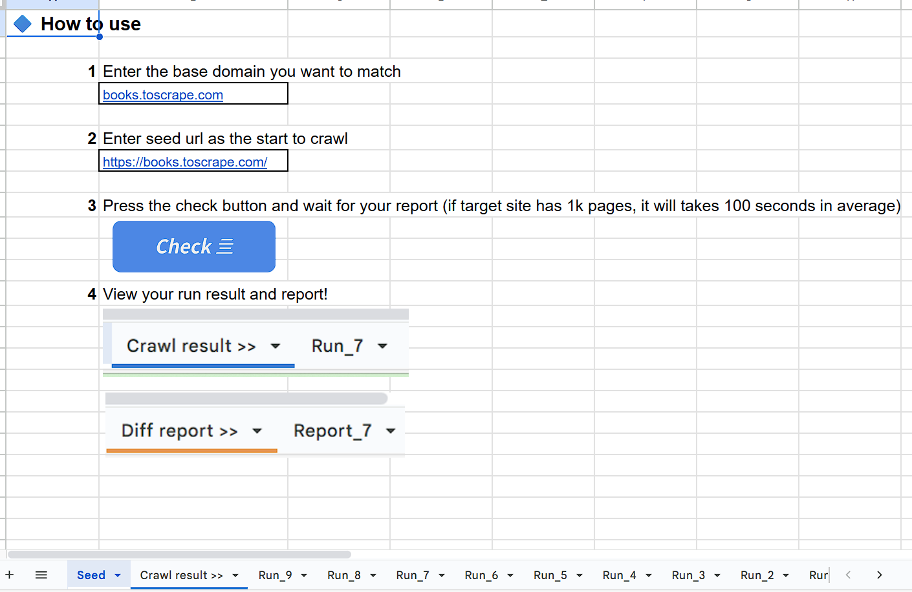
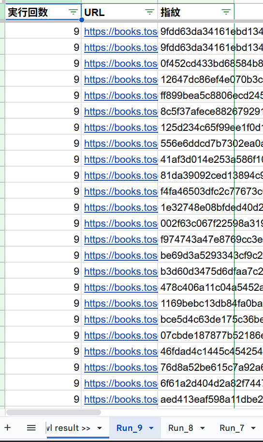
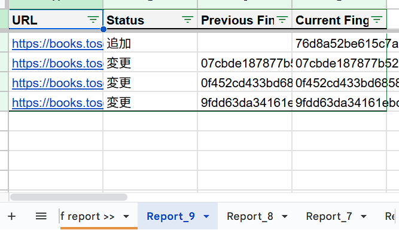

# html-ftp-checker

[](https://www.typescriptlang.org/) [](https://script.google.com/) [](https://nodejs.org/)

`html-ftp-checker` は、ウェブサイトのコンテンツ変更を自動監視するための Google Apps Script (GAS) ツールです。

指定されたドメイン内の内部リンクを再帰的に巡回し、各ページのコンテンツから **SHA-256 フィンガープリント（ハッシュ値）** を生成します。実行ごとのデータを比較することで、ページの追加・更新・削除、およびリンク切れの可能性を検出し、スプレッドシートに詳細なレポートを出力します。

## 核心機能 (Core Features)

* **再帰的クロール:** シードURLから開始し、同一ドメイン内の全ページを自動抽出。
* **コンテンツ指紋（Fingerprinting）:** SHA-256ハッシュを用いて、テキストや構造の微細な変化を検知。
* **差分レポート生成:** 前回実行時との比較を行い、「追加・修正・削除」を分類。
* **自動クリーンアップ:** スプレッドシートの肥大化を防ぐため、古い履歴シートを自動削除。
* **モダンな開発環境:** TypeScript + `clasp` によるローカル開発とバージョン管理。

---

## 0. 使用イメージ (Usage Image)

### 1. `Seed` シート（設定と起動）

監視の起点となる情報を入力します。

* **base_domain:** 内部リンクを識別するためのホスト名（例: `example.com`）。
* **seed_url:** クロールを開始するトップページ等のURL。



### 2. `Run_${n}` シート（フィンガープリント詳細）

各ページの取得結果と、その時点の SHA-256 ハッシュ値を保存します。


### 3. `Report_${n}` シート（比較レポート）

前回の `Run` シートと比較し、差異を抽出します。

* **不変 (Unchanged):** サイト全体に変化がない場合。
* **差分あり:** 追加・変更・削除されたURLをリストアップ。



---

## 1. ビジネスロジック (Business Logic)

プロジェクトの動作フローは以下の通りです：

1. **初期化:** `sheetHandler` が `Seed` シートからドメインとURLを読み込み。
2. **解析:** `crawler` が `Cheerio` を使用してHTMLをパースし、内部リンクを抽出。
3. **ハッシュ化:** `crawler` が各ページの `blob` データから SHA-256 ハッシュを生成。
4. **比較:** `reportGenerator` が今回のデータと前回のデータを照合。
5. **出力:** `sheetHandler` が結果を新しいシートに書き込み、古いシートを削除。

---

## 2. インストールとセットアップ (Setup)

### 前提条件

* Node.js (v18+) & npm
* Google `clasp` (`npm install -g @google/clasp`)

### 手順

1. **クローンと依存関係の解決:**
```bash
git clone https://github.com/johnChow-tech/html-ftp-checker.git
cd html-ftp-checker
npm install
```
2. **ログインと紐付け:**
```bash
clasp login
clasp create --title "html-ftp-checker" --type spreadsheet # または既存のIDに紐付け
```
3. **スプレッドシートの名前付き範囲設定:**
* `Seed` シートを作成。
* セルに `base_domain` と `seed_url` を入力し、それぞれのセルに**名前付き範囲**を設定してください。

---

## 3. 開発とデプロイ (Development)

ソースコードの編集は `src/` ディレクトリで行います。

* **ビルドとプッシュ:**
```bash
npm run push
```
*※このコマンドは `tsc` によるコンパイルと `clasp push` を連続して実行します。*

### プロジェクト構造
```text
src/
├── main.ts            # 全体の実行フロー制御
├── crawler.ts         # HTML解析・再帰クロール・ハッシュ生成
├── reportGenerator.ts # 新旧データの比較ロジック
├── sheetHandler.ts    # スプレッドシートの読み書き・シート管理
├── configs.ts         # 定数管理（シート名、保持数など）
└── types.ts           # 型定義
```

---

## 4. 実行方法 (Execution)
1. Google Apps Script エディタから `checkInternalLinks` 関数を選択して実行します。
2. 初回実行時は、スプレッドシートへのアクセスと外部通信の権限承認が必要です。
3. 完了後、スプレッドシートに新しい `Run_` シートと `Report_` シートが追加されていることを確認してください。